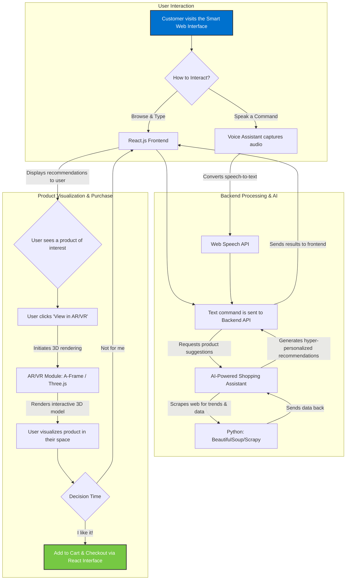

# 🛍️ Reimagining Customer Experience with Emerging Technologies

## 🚀 Sparkathon Walmart Hackathon Submission

In today’s fast-paced, digital-first world, **customer experience** is the ultimate competitive edge. With limitless options available at their fingertips, modern shoppers expect **seamless, intuitive, and highly personalized interactions**—whether online, via mobile, or in physical stores.

Our project for the **Sparkathon Walmart Hackathon** leverages **emerging technologies** to reimagine the future of retail and elevate customer engagement to new heights.

---

## 🎯 Problem Statement

**Reimagining customer experience with emerging technologies**

---

## 💡 Solution Overview

We propose a **multi-modal customer engagement system** that brings together:

- 🤖 **AI-Powered Shopping Assistant** – for hyper-personalized recommendations and real-time suggestions using web scraping and NLP.
- 🖼️ **AR/VR Experience** – enabling customers to visualize products in a 3D/immersive space before purchasing.
- 🎙️ **Voice Assistant** – to enable natural, conversational interactions with the shopping system.
- 💻 **Smart Web Interface** – a seamless React-based frontend for browsing and interaction.

---

## 🛠️ Tech Stack

| Component | Technology Used |
|----------|------------------|
| Frontend | React.js |
| Web Scraping for Recommendations | Python + BeautifulSoup/Scrapy |
| Backend API | Node.js + Express.js |
| Voice Assistant | JavaScript + Web Speech API |
| AR/VR Integration | A-Frame / Three.js |
| Hosting | [Optional: Vercel / Netlify / Render] |

---

## 👥 Team Members & Contributions

- 🎨 **Solanki Sarkar** – Frontend (React.js), UI/UX, Web Scraping for product suggestions
- 🧠 **Tirthankar Pal** – Backend APIs and Database (Express.js)
- 🎤 **Samridhha Haldar** – Voice Assistant Integration
- 🕶️ **Ritik Maurya** – AR/VR Feature Implementation

---

## 📸 Key Features

- 🔍 **Personalized Product Discovery**: Get real-time suggestions based on trending data and user interests.
- 🗣️ **Conversational Shopping**: Use voice commands to explore, add to cart, and check out.
- 🛒 **Immersive Preview**: View products in AR/VR to make better-informed decisions.
- ⚡ **Unified UI**: Clean, responsive interface built for intuitive user journeys.

---

## 🔮 Future Scope

- Integration with **Walmart APIs** for real inventory and pricing data
- Advanced ML-based recommendation engines
- In-store AR navigation and checkout
- Multi-language support for inclusivity

---

## 📦 How to Run Locally

1. **Clone the repository**  
   `git clone https://github.com/solanki505/Walmart-sparkathon`

2. **Frontend**  
```bash
cd frontend
npm install
npm start
```
## 📚 Inspiration

Walmart's commitment to **ultra-personalized shopping experiences** and **technology-driven transformation** served as a major inspiration for this project. We aim to build upon that vision by designing a solution that is intuitive, scalable, and delightful to use.

---

## 🏁 Let's Redefine Retail – One Experience at a Time!

> “Build technology that makes shopping feel effortless, engaging, and deeply relevant.”
